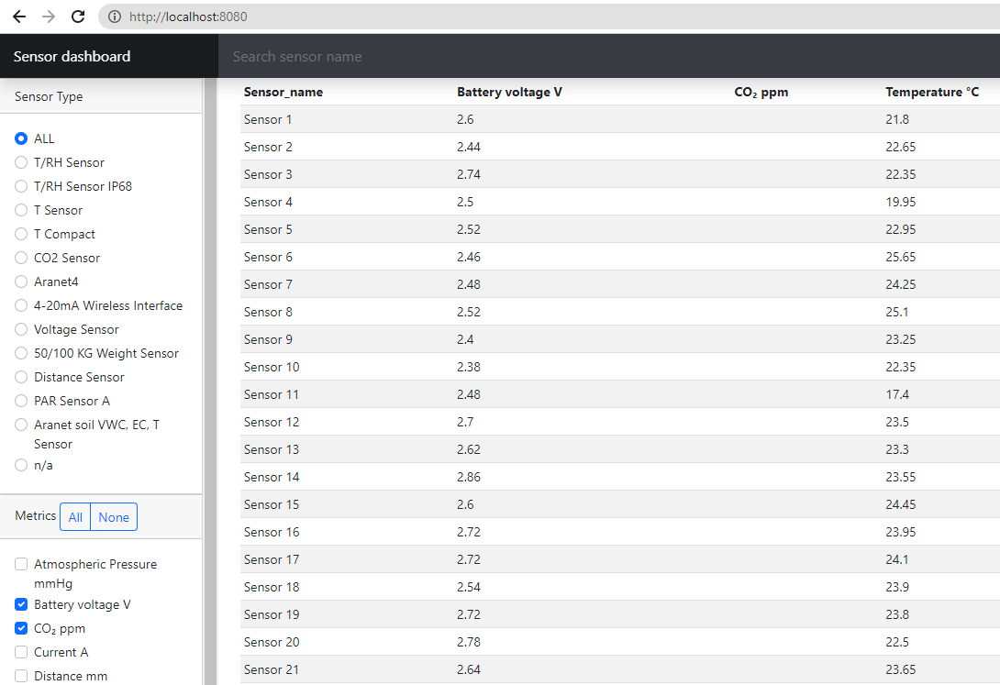

# sensor-metrics-dashboard
Vue/Django application to present data from sensors.

## Goals
To develop a web application that can display data from sensors. 
* The application should request data from a Python-based back-end API.
* The frontend should be developed with Vue.js
* The solution should be delivered as Docker container(s).

### Data
The data is located in the 3 files on the server:
* [sensors.json](docs/sensors.md) - a bunch of actual **measurements** from sensors, with the specific metric IDs and values, as well as with sensor names, types and versions of the sensor
* [metrics.json](docs/metrics.md) - metrics reference, with metric names and a number of units relevant to the metric. An active unit is denoted with "selected":true property
* [sensorTypes.json](docs/sensor_types.md) - sensor types reference, which can be used to attach sensor type label by sensor type and version IDs

### Specific requirements
1. Columns to display:
   1. Sensor name from `sensors.json`
   2. Metric value columns. Column name is a metric name + the active metric's  unit form metrics.json. Metrics' values are values from sensors.json.
2. Asc/Desc sort functionality for any of the columns.
3. Filtering records by sensor type name.
4. Including/excluding metrics columns in/from the table.
5. Decisions made for missing values processing.


## Solution
### Architecture
* Django (v. 4.1.7) framework as back-end API.
* `pandas` (v. 1.4.3) is used for data merging and manipulation.
* Vue.js 3 (v. 3.2.47) for a frontend app. `npm` version used to build application: 9.5.1.
* Bootstrap 5 (v. 5.2.3)
* Docker (v. 20.10.22) and docker-compose (v. 2.15.1):
  * `django`: container with `gunicorn` server running on port 8000, from the image built with Dockerfile
  * `frontend`: container with `nginx` and compiled Vue application, depends on `django`. We use here 2-stage built image with frontend/Dockerfile. 
* `Nginx` listens port **8080** and proxies requests to http://localhost:**8080** to Vue application, and proxies requests issued from inside application to API URL to Django's http://localhost:**8000**/api/sensors/ endpoint.

### Decisions made re missing data
1. Empty sensor names are imputed with 'id' prefix followed by sensor ID, which preserves chances to identify the unnamed sensor in some way.
2. For sensors with no sensor types found in sensorTypes.json, sensor type is set to be 'n/a' (not available), so to make this special category selectable in the filter.
3. Missing metrics values, which are irrelevant to a specific sensors are kept untouched, and denoted in the resulting dashboard as empty cells.4. 

## Build/Run instructions
### .env file
```
DJANGO_SECRET_KEY=longrandomstring
DJANGO_PORT=8000
DJANGO_DEBUG=1
DJANGO_ALLOWED_HOSTS=localhost

FRONTEND_HOST=localhost
FRONTEND_PORT=8080
```

The application is shipped in 2 Docker containers. To spin them up, from the source root (where the `docker-compose.yml` file is located):
* `docker compose up --build`

Then in your browser, open:
* `http://localhost:8080/`
 
Now, you see it:


##TODOs
* rename sensor_name column to Sensor name in Vue
* more tests for django sensors view
* e2e tests
* logging
